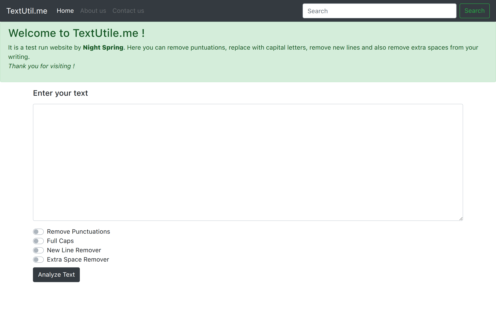
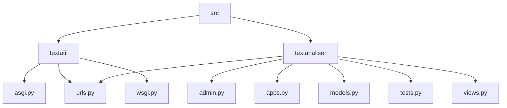

# Text Utility Project

## 🗂️ Description

The Text Utility Project is a web application designed to analyze and process text inputs. It provides a simple and intuitive interface for users to submit text and receive analyzed results. The project is built using Django, a high-level Python web framework, and is suitable for developers and researchers working with text data.

The project aims to provide a flexible and extensible platform for text analysis, allowing users to easily add or modify analysis features as needed. With its modular design and clear documentation, the Text Utility Project is an ideal starting point for anyone looking to build a text analysis application.

## ✨ Key Features

* **Text Analysis**: The project provides a basic text analysis feature, allowing users to submit text and receive analyzed results.
* **Modular Design**: The project is built using a modular design, making it easy to add or modify features as needed.
* **Django Framework**: The project uses the Django framework, providing a robust and scalable foundation for the application.
* **User-Friendly Interface**: The project provides a simple and intuitive interface for users to submit text and receive analyzed results.

## 🗂️ Folder Structure



## 🛠️ Tech Stack


## ⚙️ Setup Instructions

To run the project locally, follow these steps:

* Clone the repository: `git clone https://github.com/night-spring/Textutil.git`
* Navigate to the project directory: `cd Textutil`
* Install dependencies: `pip install -r requirements.txt`
* Run migrations: `python manage.py migrate`
* Run the development server: `python manage.py runserver`
* Open a web browser and navigate to `http://localhost:8000` to access the application.

## 📈 GitHub Actions

The project uses GitHub Actions to automate deployment and testing. The workflow is defined in the `.github/workflows/main.yml` file and includes the following steps:

* Build and test the project
* Deploy to Vercel

```yml
name: Main Workflow

on:
  push:
    branches:
      - main

jobs:
  build-and-deploy:
    runs-on: ubuntu-latest
    steps:
      - name: Checkout code
        uses: actions/checkout@v2

      - name: Install dependencies
        run: |
          pip install -r requirements.txt

      - name: Build and test
        run: |
          python manage.py test

      - name: Deploy to Vercel
        uses: amondnet/vercel-action@v20
        with:
          vercel-token: ${{ secrets.VERCEL_TOKEN }}
          vercel-org-id: ${{ secrets.VERCEL_ORG_ID }}
          vercel-project-id: ${{ secrets.VERCEL_PROJECT_ID }}
```


<br><br>
<div align="center">

<h3>Debojit Roy</h3>
<p>Focused on backend development and machine learning.</p>
</div>
<br>
<p align="right">
  <a href="https://gitfull.vercel.app">Made by GitFull</a>
</p>
    